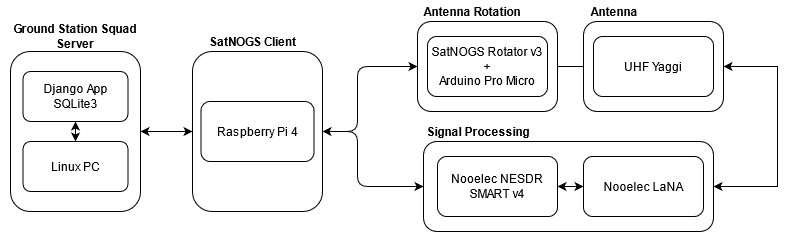

## Project Definition - Ground Station Squad

Theoretical knowledge gives you a deeper understanding of a concept through seeing it in the context of understanding the why behind it.
Practical knowledge, on the other hand, can often lead to a deeper understanding of a concept through the act of personal experience.

The Space Challenges' program is structured in a way that combines both and allows the participants to perform at an exceptional level.
One of the projects in this year's edition challenged the participants to build a fully functional ground station and establish successful signal reception from one of EnduroSat's satellites.

---

### Ground Station Requirements

#### Mission

Successful reception of data from EnduroSat's QMR-KWT satellite via a SatNOGS ground station over UHF frequency range that captures 2 passes a day.

#### System

1. The system shall be connected to the SatNOGS network
2. The system shall process radio signals via an SDR
3. The system shall track orbiting satellites with a rotator
4. The system shall be able to capture low power signals from cube satellites
5. The system shall capture radio signals in the UHF frequency range
6. The system shall support the 2GFSK modulation scheme
7. The system shall provide a data platform that allows users to store satellite data and book timeslots for the ground station

#### Subsystem

1. A Raspberry Pi shall be used as a SatNOGS client
2. A RTL2832U & R820T2 based SDR shall be used - e.g. Nooelec NESDR SMArt v4
3. A rotator should be build according to the SatNOGS Rotator v3 design
4. A wide-band LNA should be used to improve signal reception - e.g. Nooelec LaNa
5. A Yagi antenna should be build according to the following specifications:
	- Minimum frequency (MHz): 435 
	- Maximum frequency (MHz): 438 
	- Number of directors: 8 
	- Optimized for frequency of 436.5MHz 
	- Length of Reflector: 36.08cm 
	- Driven element length: 34.36 cm (a folded dipole antenna has 4 times higher impedance compared to a non-folded dipole; for space applications lower impedance of 50ohms is preferred using a non-folded/linear dipole)
	- Director length: 30.93 cm 
	- Spacing between reflector and driven element: 17.18 cm 
	- Spacing between driven element and director: 19.24 cm 
	- Spacing between directors: 22.91 cm 
	- Approximate gain: 16.6 dBi (-3dBi) 
	- Length of boom: 2.1 m
	- Balun: e.g. RG174 (Velocity of propagation Vc=0.66)
	- Wavelength WL = 69cm
	- L1 = 11.4cm
	- L2 = 34.2cm
6. GNU Radio should be used to perform processing of the received signal
7. A web platform should be build according to the following specifications:
    - Python 3.9 shall be used as a programming language
    - Django shall be used as a web framework
    - SQLite3 shall be used as a database
    - The web app should provide the following features:
        - GS booking
        - Authentication
        - Remote command transmission

